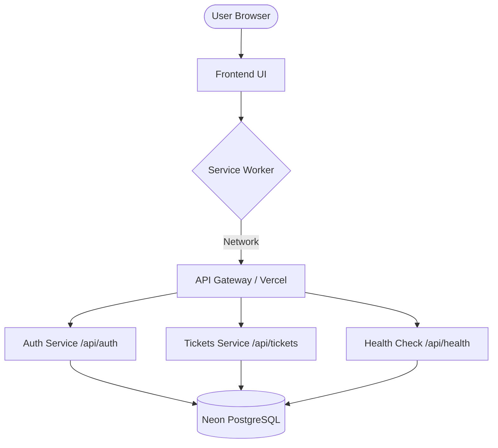
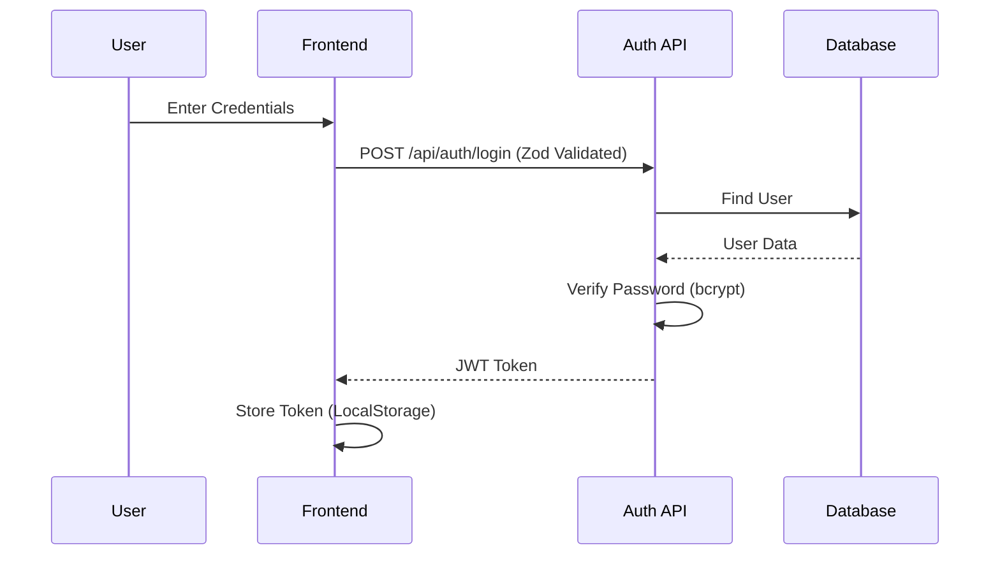

# ActivityFlow - Agile Developer Kanban Board

ActivityFlow is a high-performance, industry-standard Kanban application designed for developer teams. It features a robust TypeScript backend, real-time system health monitoring, and a sleek, responsive UI.

## 🚀 Technology Stack

- **Frontend**: Vanilla JS (ES Modules), Custom CSS, FontAwesome.
- **Backend**: Node.js, Express (TypeScript), Zod (Validation), Helmet (Security).
- **Database**: Prisma ORM with Neon (PostgreSQL) for production.
- **Infrastructure**: Vercel (Deployment), Service Workers (PWA/Caching).

## 📊 System Architecture

### Data Flow Diagram

### Authentication Flow

## 🛠️ API Documentation

### System Health
- `GET /api/health`: Returns 200 OK if DB connection is active. Includes timestamp.

### Authentication
- `POST /api/auth/register`: Create a new developer account.
- `POST /api/auth/login`: Login and receive a JWT token.

### Tickets
- `GET /api/tickets`: Fetch all board tickets (Auth Required).
- `POST /api/tickets`: Create a new ticket (Auth Required).
- `PUT /api/tickets/:id`: Update ticket status, priority, or content.
- `DELETE /api/tickets/:id`: Remove a ticket from the board.

## 💻 Local Development

1. **Install Dependencies**: `npm install`
2. **Setup Env**: Create `.env` with `DATABASE_URL` and `JWT_SECRET`.
3. **Run Dev**: `npm run dev`
4. **Build**: `npm run build`

## 🛡️ Security Features
- **Rate Limiting**: Protected auth endpoints from brute-force.
- **Helmet**: Secure HTTP headers configuration.
- **CORS**: Domain-restricted access control.
- **Input Validation**: Strict Zod schema enforcement.
